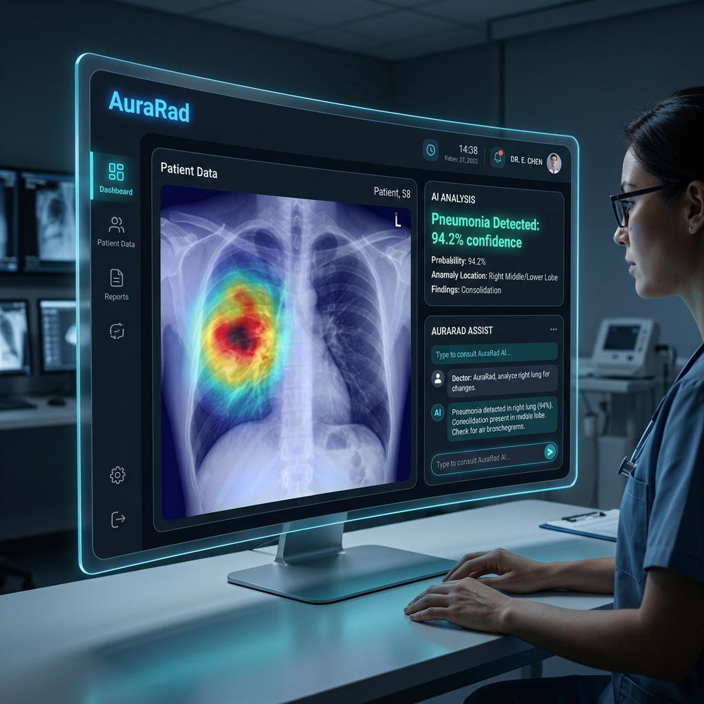
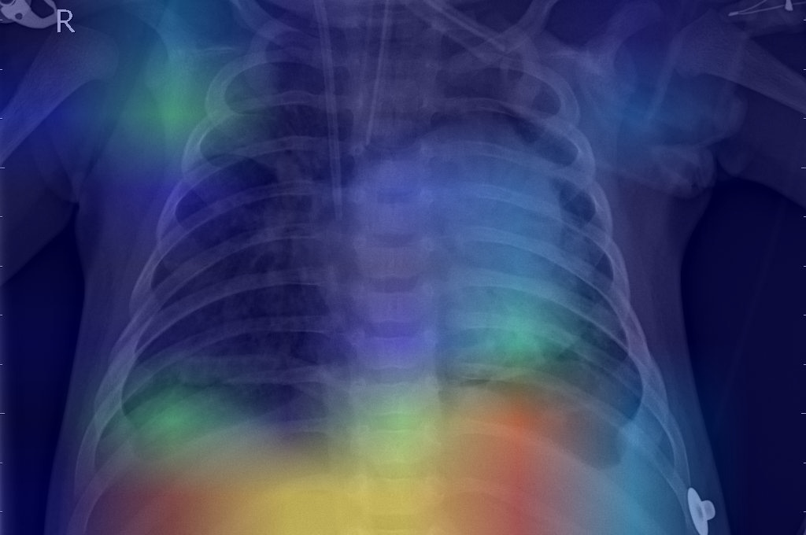

# AuraRad: AI-Powered Medical X-Ray Diagnostic System

AuraRad is a state-of-the-art medical imaging platform designed to assist radiologists in detecting pneumonia from chest X-ray images. It combines advanced deep learning (CNNs) with Explainable AI (XAI) to provide both a prediction and a visual justification (Grad-CAM) for its findings.



## 🚀 Key Features

- **Pneumonia Detection**: High-accuracy classification using custom Convolutional Neural Networks.
- **Explainable AI (XAI)**: Integrated Grad-CAM visualization to highlight specific regions of interest in X-rays.
- **Interactive Chatbot**: AI-driven medical assistant to help interpret results and provide general information.
- **Modern UI/UX**: Premium, executive-level dashboard built with Next.js and high-end CSS.
- **Scalable Backend**: Robust API built with FastAPI, supporting asynchronous image processing.
- **Dockerized Architecture**: Easy deployment using Docker and Docker Compose.

## 🧠 AI Visualizations (Grad-CAM)

The system doesn't just provide a diagnosis; it explains **why** it made that decision by highlighting the areas of the lung it found suspicious.



## 🛠️ Tech Stack

- **Frontend**: Next.js, TypeScript, Vanilla CSS (Premium Glassmorphism).
- **Backend**: FastAPI (Python), SQLAlchemy, SQLite.
- **AI/ML**: TensorFlow/Keras, OpenCV, NumPy.
- **XAI**: Grad-CAM (Gradient-weighted Class Activation Mapping).
- **DevOps**: Docker, Docker Compose.

## 📁 Project Structure

```text
├── ai_core/          # CNN Model architecture and Grad-CAM logic
├── backend/          # FastAPI server, database models, and API routes
├── frontend/         # Next.js web application
├── chatbot/          # AI Chatbot integration
├── docker-compose.yml # Container orchestration
└── models/           # (Excluded from Git) Trained model weights
```

## 🚦 Getting Started

### Prerequisites

- Python 3.9+
- Node.js 18+
- Docker (optional)

### Installation

1. **Clone the repository**:
   ```bash
   git clone https://github.com/YOUR_USERNAME/xray_disease_detector_gui2.git
   cd xray_disease_detector_gui2
   ```

2. **Backend Setup**:
   ```bash
   cd backend
   pip install -r requirements.txt
   python main.py
   ```

3. **Frontend Setup**:
   ```bash
   cd ../frontend
   npm install
   npm run dev
   ```

## 🧠 Model Architecture

The system utilizes a custom CNN architecture optimized for chest X-ray analysis, featuring:
- Depthwise Separable Convolutions for efficiency.
- Global Average Pooling to reduce overfitting.
- Specialized preprocessing pipeline for medical imaging contrast enhancement.

## 📄 License

This project is licensed under the MIT License - see the [LICENSE](LICENSE) file for details.

---

*Disclaimer: This tool is for educational/research purposes and should not be used as a primary diagnostic tool in clinical settings.*
